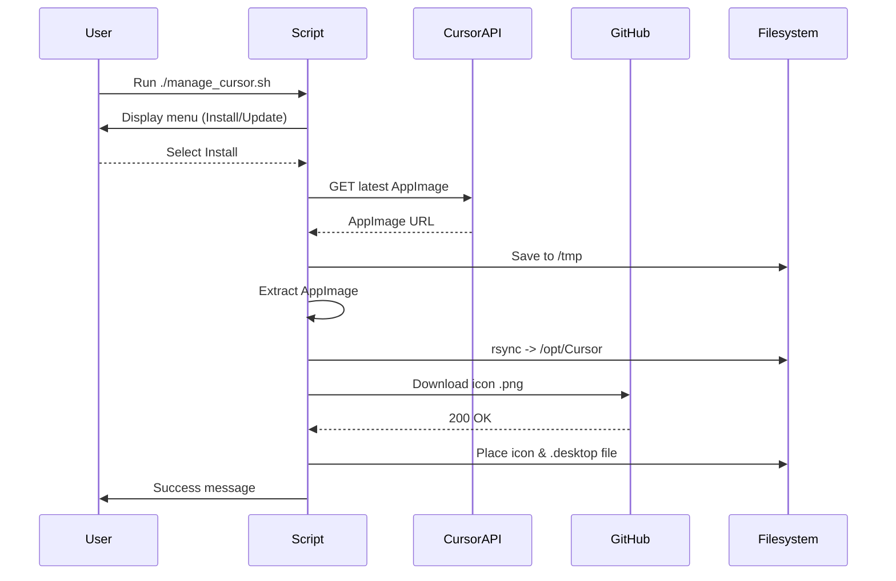

# Project Mechanism Documentation

## Overview

This repository provides an interactive Bash script (`manage_cursor.sh`) that **installs** or **updates** the **Cursor AI IDE** on Ubuntu&nbsp;24.04 systems.  While the existing `README.md` focuses on *how to use* the script, this document dives into *how the script itself works* and the design decisions behind it.

> If you are only interested in getting Cursor running, see `README.md`.  Read on if you want to understand the inner workings or plan to modify the script.

---

## File & Directory Layout

| Path | Purpose |
| --- | --- |
| `manage_cursor.sh` | Main driver script that handles installation and updates |
| `images/` | Contains sample PNG icons used during installation |
| `/opt/Cursor` (created by the script) | Destination directory for the unpacked AppImage |
| `/usr/share/applications/cursor.desktop` | Desktop entry created for system-wide launcher |

---

## High-Level Workflow

1. **Banner + Menu** –  Shows an ASCII banner (using `figlet`) and prompts the user to *install* or *update*.
2. **Branch to Function** –  Depending on the user's choice, execution jumps to `installCursor` or `updateCursor`.
3. **AppImage Acquisition** –  The script either
   - automatically **downloads** the latest Cursor AppImage via the Cursor public API, _or_
   - **uses a local file path** provided by the user.
4. **Extraction** –  The AppImage is executed with `--appimage-extract`, producing a `squashfs-root/` directory in `/tmp`.
5. **Deployment** –  Contents of the extracted folder are **rsync-moved** into `/opt/Cursor` (creating it if necessary).
6. **Icon & Desktop Entry** –  A PNG icon is downloaded from GitHub and placed inside `/opt/Cursor`; a `.desktop` file referencing that icon and the `AppRun` executable is created under `/usr/share/applications`.
7. **Cleanup & Finish** –  Temporary files are removed, success messages are displayed.

Updating follows the same steps, except it first **removes** the existing contents of `/opt/Cursor` before copying in the new version.

---

## Key Components Explained

### 1. Global Variables

```bash
CURSOR_EXTRACT_DIR="/opt/Cursor"      # Target install directory
ICON_FILENAME_ON_DISK="cursor-icon.png" # Standard icon name once stored
ICON_PATH="${CURSOR_EXTRACT_DIR}/${ICON_FILENAME_ON_DISK}"
EXECUTABLE_PATH="${CURSOR_EXTRACT_DIR}/AppRun"  # Launch target inside AppImage
DESKTOP_ENTRY_PATH="/usr/share/applications/cursor.desktop"
```

Keeping these definitions at the top makes it trivial to retarget the installation for a **per-user** setup (e.g., changing to `$HOME/.local/opt/Cursor`).

### 2. `download_latest_cursor_appimage()`

1. Calls the official Cursor API endpoint:  
   `https://www.cursor.com/api/download?platform=linux-x64&releaseTrack=stable`  
   This returns a JSON blob with either `url` or `downloadUrl`.
2. Uses `curl` + `jq` to extract the actual download link.
3. Saves the file to `/tmp/latest-cursor.AppImage` with `wget`.
4. Emits the path of the downloaded file **on STDOUT** so the caller can easily capture it.

Why this approach?  – It avoids hard-coding version numbers and always fetches the latest stable release.

### 3. `installCursor()`

*Highlights*
- **Idempotency Check:** Exits back to the main menu if `/opt/Cursor` already exists.
- **Dependency Assurance:** Validates presence of `curl`, `wget`, `jq`, and `rsync`, auto-installing them via `apt` if missing.
- **Interactive Prompts:** Lets the user decide between auto-download vs manual file path _and_ choose an icon filename.  This keeps the script generic and asset-agnostic.
- **Extraction & Deployment:** Uses `(cd /tmp && "$APPIMAGE" --appimage-extract)` so the current working directory is *not* cluttered.

### 4. `updateCursor()`

Essentially mirrors `installCursor()` but:
- Skips the idempotency check (directory must exist).
- **Deletes** existing contents before syncing the new ones.
- Re-uses the icon and desktop file locations, so user doesn't have to pick an icon again.

### 5. Banner / UX

`figlet` is installed if absent and used to render a stylised **"Cursor AI IDE"** title.  A playful ASCII cat is printed afterwards.  These touches improve readability and assure users they invoked the right script.

---

## Error Handling Strategy

- Each critical step checks the **exit status** (`$?`) and aborts with a red ❌ message on failure.
- Temporary files in `/tmp` and old downloads are removed even on error paths when possible.
- The user is **re-prompted** if an automatic download fails, reducing dead-ends.

---

## Customising the Script

| Use-Case | What to Change |
| --- | --- |
| Install for a single user (no `sudo`) | Set `CURSOR_EXTRACT_DIR="$HOME/.local/opt/Cursor"` and adjust `DESKTOP_ENTRY_PATH` to `$HOME/.local/share/applications/cursor.desktop` |
| Use a corporate mirror for downloads | Modify `API_URL` or bypass `download_latest_cursor_appimage()` |
| Skip icon prompt | Hard-code `ICON_NAME_FROM_GITHUB` or remove the download step |

Because the logic is consolidated into well-named functions, these tweaks require minimal code edits.

---

## Sequence Diagram

Below is a simplified sequence of events during **installation**:



---

## Security Notes

1. **Sandbox Flag** –  The desktop entry launches with `--no-sandbox` because many AppImages require it when run as root-owned files.  If you trust the binary, this is acceptable; otherwise consider using a wrapper like `firejail`.
2. **Checksum Validation** –  Currently not implemented.  If supply-chain integrity is critical, add a checksum step after download.

---

## Conclusion

The script is intentionally **self-contained**, leveraging only widely available GNU utilities and Ubuntu's package manager.  By unpacking the AppImage into a conventional directory it avoids the "double-click to mount" hurdle and integrates Cursor AI IDE seamlessly into the desktop environment.

Feel free to open a pull request if you spot improvements or wish to extend the workflow! 